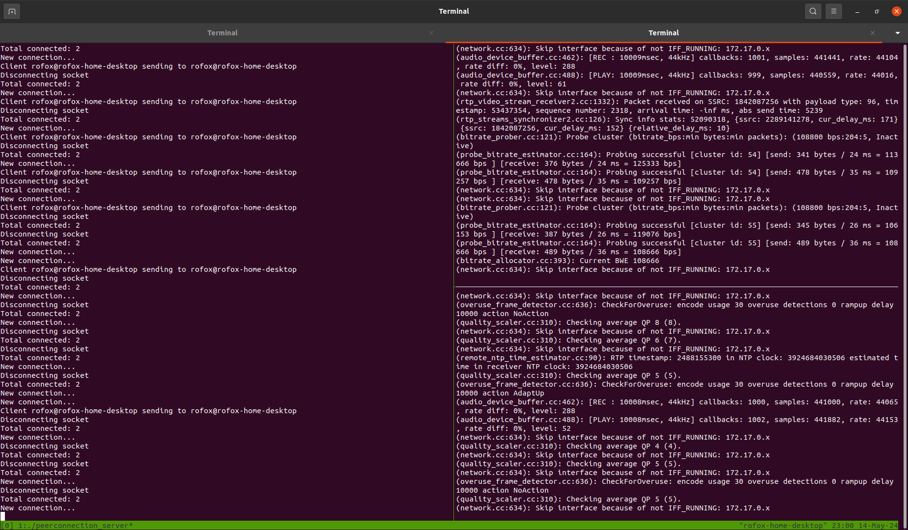
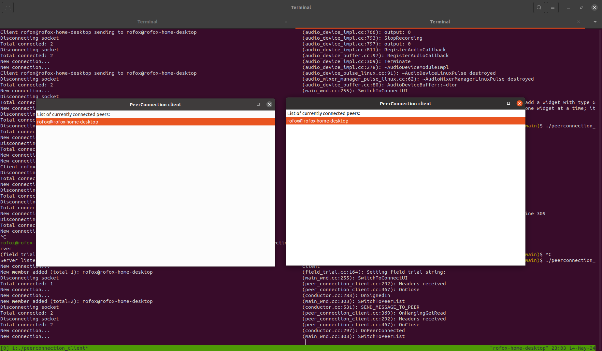
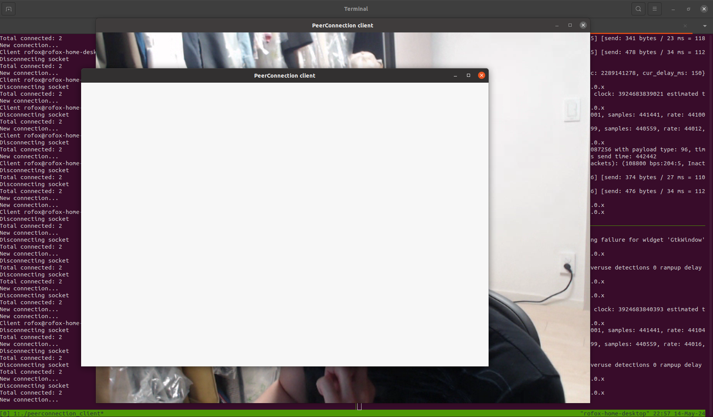

##
### Signaling Server
```
cd python3
python3 signaling_server.py
```

### Peer DataChannel Client
```
mkdir build
cd build
cmake ..
make -j
```
* Host 1
```
./peer_datachannel_client
```
* Host 2
```
./peer_datachannel_client
```

## Chromium WebRTC Implementation
### References
* Official Development Document
  * https://webrtc.github.io/webrtc-org/native-code/development/
  * https://commondatastorage.googleapis.com/chrome-infra-docs/flat/depot_tools/docs/html/depot_tools_tutorial.html#_setting_up
* Official Branch Details
  * https://chromiumdash.appspot.com/branches
* build libwebrtc.a
  * https://github.com/Tohntobshi/webrtcexample
  * https://github.com/aisouard/libwebrtc
* DataChannel Sample
  * https://github.com/llamerada-jp/webrtc-cpp-sample
* Audio/Video/Data
  * https://github.com/MemeTao/webrtc-native-examples
* Mozilla Mirror
  * https://github.com/mozilla/libwebrtc
* How To Compile Native WebRTC Library from Source for Android
  * https://medium.com/@abdularis/how-to-compile-native-webrtc-from-source-for-android-d0bac8e4c933

### clang
* Install clang on Ubuntu
  * https://apt.llvm.org/
  * https://ubuntuhandbook.org/index.php/2023/09/how-to-install-clang-17-or-16-in-ubuntu-22-04-20-04/
  ```
  wget https://apt.llvm.org/llvm.sh
  chmod +x llvm.sh
  sudo ./llvm.sh <version number>
  ```
* https://libcxx.llvm.org/UsingLibcxx.html#using-a-custom-built-libc

### Building libc++
* https://libcxx.llvm.org/BuildingLibcxx.html
* Find right version of clang


```
git clone https://github.com/llvm/llvm-project.git
git checkout cf31d0eca85f4f5b273dd1ad8f76791ff726c28f # matching chrome-libcxx
mkdir build
```
```
cmake -G Ninja -S runtimes -B build -DLLVM_ENABLE_RUNTIMES="libcxx;libcxxabi;libunwind"  -DCMAKE_CXX_COMPILER=clang++-18 -DCMAKE_C_COMPILER=clang-18 -DLIBCXX_ABI_NAMESPACE=__Cr \
-DLIBCXX_ABI_UNSTABLE=ON \
-DLIBCXX_ENABLE_VENDOR_AVAILABILITY_ANNOTATIONS=OFF \
-DLIBCXX_PSTL_CPU_BACKEND="std_thread" \
```
```
-DLIBCXX_ENABLE_STD_MODULES=OFF \ # https://en.cppreference.com/w/cpp/language/modules
```
```
ninja -C build cxx cxxabi unwind
```
#### Backup
```
-D_LIBCPP_ABI_NAMESPACE=__Cr -D_LIBCPP_ABI_VERSION=2 \
-D_LIBCPP_HAS_NO_VENDOR_AVAILABILITY_ANNOTATIONS=ON \
-D_LIBCPP_PSTL_CPU_BACKEND_THREAD=ON \
-D_LIBCPP_NO_AUTO_LINK \
-D_LIBCPP_REMOVE_TRANSITIVE_INCLUDES \
-D_LIBCPP_NO_ABI_TAG \
-D_LIBCPP_CHAR_TRAITS_REMOVE_BASE_SPECIALIZATION
```
```diff
diff --git a/libcxx/include/__config_site.in b/libcxx/include/__config_site.in
index c85cbcd02c44..f7096368d78f 100644
--- a/libcxx/include/__config_site.in
+++ b/libcxx/include/__config_site.in
@@ -9,8 +9,8 @@
 #ifndef _LIBCPP___CONFIG_SITE
 #define _LIBCPP___CONFIG_SITE

-#cmakedefine _LIBCPP_ABI_VERSION @_LIBCPP_ABI_VERSION@
-#cmakedefine _LIBCPP_ABI_NAMESPACE @_LIBCPP_ABI_NAMESPACE@
+#cmakedefine _LIBCPP_ABI_VERSION 2
+#cmakedefine _LIBCPP_ABI_NAMESPACE __Cr
 #cmakedefine _LIBCPP_ABI_FORCE_ITANIUM
 #cmakedefine _LIBCPP_ABI_FORCE_MICROSOFT
 #cmakedefine _LIBCPP_HAS_NO_THREADS

```
### WebRTC Native Source Download
```
git clone https://chromium.googlesource.com/chromium/tools/depot_tools.git

export PATH=/path/to/depot_tools:$PATH
```
```
mkdir webrtc-checkout
cd webrtc-checkout
fetch --nohooks webrtc    // about 10 minutes
gclient sync              // about 5 minutes
```
* checkout the milestone `119`
```
cd src
git checkout branch-heads/6045
gclient sync
```
### Configuration
```
gn gen out/Default
```
```
gn gen out/Release --args='is_debug=false'
```
* https://stackoverflow.com/questions/47348330/error-linking-webrtc-native-due-to-undefined-reference-to-methods-having-stdst
```
gn gen out/Custom --args='use_custom_libcxx=false use_custom_libcxx_for_host=false'
```
* https://github.com/webrtc-sdk/libwebrtc
* https://github.com/aisouard/libwebrtc
```
export ARCH=x64 # x86, x64, arm, arm64
gn gen out/Linux-$ARCH --args="target_os=\"linux\" target_cpu=\"$ARCH\" is_debug=false rtc_include_tests=false rtc_use_h264=true ffmpeg_branding=\"Chrome\" is_component_build=false use_rtti=true use_custom_libcxx=false rtc_enable_protobuf=false"
```
```
gn ls out/Default
```
```
gn args out/Default --list
gn args out/Default --list --short
```
### Build
```
ninja -C out/Default
```
* https://groups.google.com/g/discuss-webrtc/c/do0JGb44YmM
  * libc++-10-dev
  * libc++abi-10-dev

```
ninja -C out/Custom webrtc
```
```
apt-get install libc++abi-11-dev libc++-10-dev
```
### Test for Video/Audio
* https://webrtc.github.io/webrtc-org/native-code/development/
  * `Example Applications` Section
* Terminal A
```
./peerconnection_server
```
* Terminal B
```
./peerconnection_client
```
* Terminal C
```
./peerconnection_client
```
  <p align="left">
    
  </p>
  * click the peer `
  <p align="left">
    
  </p>
  <p align="left">
    
  </p>


### Samples on M119
#### `clang v18`
#### `test`

#### `datachannel`

### NVIDIA Jetson on `d0c86830d0`
* Hardware Acceleration in the WebRTC Framework
  * https://docs.nvidia.com/jetson/archives/r36.3/DeveloperGuide/SD/HardwareAccelerationInTheWebrtcFramework.html
  * https://developer.nvidia.com/embedded/jetson-linux-r363
* commit id `d0c86830d00d6aa4608cd6f9970352e583f16308`

#### install `clan v17`
```
wget https://apt.llvm.org/llvm.sh
chmod +x llvm.sh
sudo ./llvm.sh 17
```
#### WebRTC Native Source Download for `libcxx`
```
git clone https://chromium.googlesource.com/chromium/tools/depot_tools.git

export PATH=/path/to/depot_tools:$PATH
```
```
mkdir webrtc-checkout
cd webrtc-checkout
fetch --nohooks webrtc    // about 10 minutes
gclient sync              // about 5 minutes
```
* checkout the milestone `119`
```
cd src
git checkout d0c86830d00d6aa4608cd6f9970352e583f16308
gclient sync
```
#### build `webRTC` (Optional)
* https://github.com/CoatiSoftware/Sourcetrail/issues/852
```
gn gen out/Default --args="clang_base_path=\"/lib/llvm-17/\" clang_use_chrome_plugins=false "
ninja -C out/Default webrtc
```
#### Download NVIDIA Precompiled `libwebrtc.a`
* download `WebRTC_R36.3.0_aarch64.tbz2` from https://developer.nvidia.com/embedded/jetson-linux-r363
```
mkdir prebuilt
tar xjvf ./WebRTC_R36.3.0_aarch64.tbz2 -C ./prebuilt
```
#### `test_nv_jetson`
```
cmake -DUSE_PREBUILT_WEBRTC=ON .. && make -j
```
```
cmake -DUSE_PREBUILT_WEBRTC=OFF .. && make -j
```

#### `datachannel_nv_jetson`
```
sudo apt-get install picojson-dev
```
```
cmake -DUSE_PREBUILT_WEBRTC=ON .. && make -j
```
```
cmake -DUSE_PREBUILT_WEBRTC=OFF .. && make -j
```


### Libraries
#### `abseil-cpp`
* latest version
* ~~`6ab667fd8deba75443fdc0d5c5bbf4588431f1b4` to match webrtc M119's abseil-cpp~~

#### `spdlog`
* `v1.9.2` for ubuntu 22.04

#### `socket.io-client`
* latest version